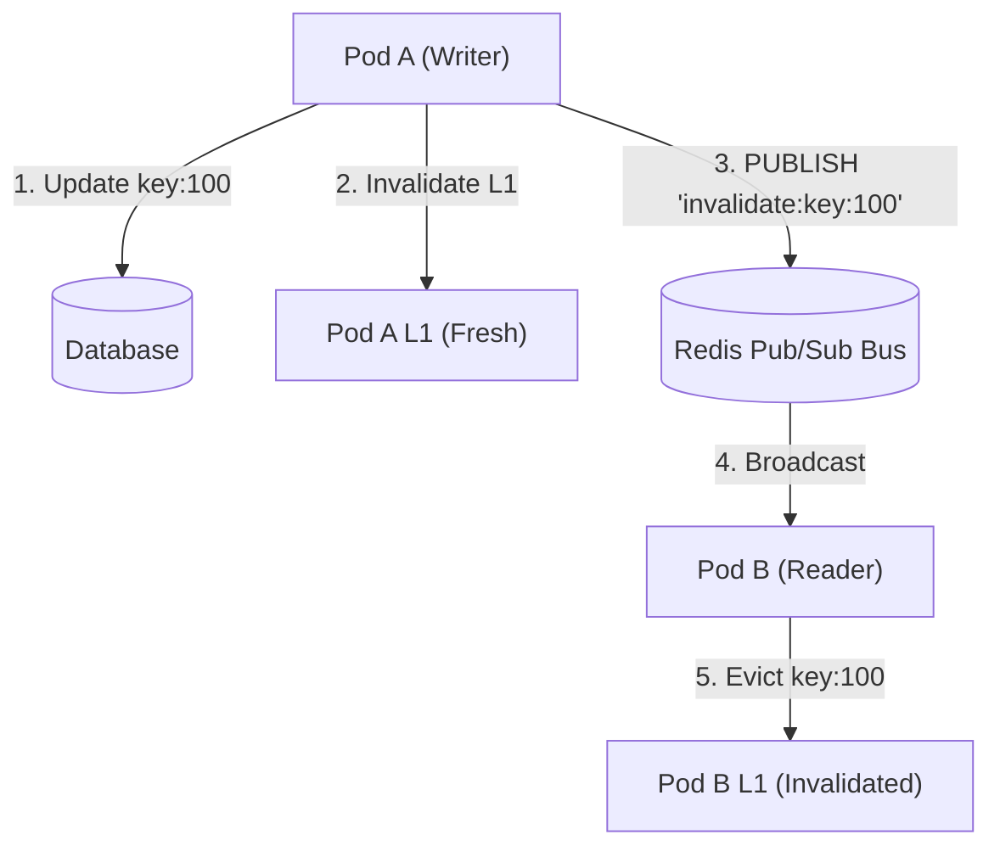

# ⚡ Multi-Tier Cache (L1 / L2 / DB), LRU/LFU Eviction & Write Policies

> **Domain:** Caching & Data Access Patterns  
> **Production Analogs:** CPU Cache Hierarchy (L1/L2/L3), In-Memory Guava/Caffeine + Remote Redis (Netflix EVCache / Meta TAO), CDN Edge + Origin Shield (Cloudflare, Akamai).  
> **Status:** `Production-Grade Reference Implementation`

---

## 1. 30-Second Decision Matrix

| If your workload requirement is… | Choose | Why | Main Trade-off |
| :--- | :--- | :--- | :--- |
| **Temporal locality (recent items re-read frequently)** | **LRU Eviction** | Ultra-simple $O(1)$ pointer operations; immediately discards inactive data. | Highly susceptible to cache pollution during sequential table scans. |
| **Frequency locality (popular hot items with high read count)** | **LFU Eviction** | Protects long-term hot items against temporary scan bursts. | Stale frequency accumulation for previously popular items (requires frequency decay). |
| **Absolute read/write consistency (e.g. user balances)** | **Write-Through** | Synchronously writes to L1, L2, and DB before returning to client. | Write latency equals slowest storage tier ($T_{DB}$). |
| **High write throughput & write coalescing (e.g. counters, metrics)** | **Write-Back (Behind)** | Absorbs writes in ultra-fast L1/L2 memory; flushes dirty records asynchronously in batches. | Risk of data loss if process crashes before dirty buffer flushes. |
| **Bulk write-once data with infrequent subsequent reads** | **Write-Around** | Writes directly to DB without polluting cache; invalidates old cache entries. | Higher initial read latency on subsequent reads (requires cache fill). |

---

## 2. Multi-Tier Cache Architecture

A single cache layer creates an inherent tension between **latency** and **capacity**:
- In-process memory (RAM) has nanosecond latency ($\approx 10\text{ ns}$ to $1\ \mu\text{s}$) but is constrained by heap limits (gigabytes).
- Distributed cache (Redis/Memcached) offers massive shared capacity (terabytes) but requires network serialization and transport ($\approx 1\text{ ms}$).
- Persistent databases (PostgreSQL/MySQL/NVMe) offer durable petabyte storage but suffer from disk I/O and query overhead ($\approx 10\text{--}50\text{ ms}$).

```
[ Incoming Request ]
         │
         ▼
┌──────────────────┐    Hit (< 0.001 ms)
│  Tier 1: L1 RAM  │ ──────────────────────> [ Return Response ]
└──────────────────┘
         │ Miss
         ▼
┌──────────────────┐    Hit (~ 1.0 ms)
│ Tier 2: L2 Redis │ ──────────────────────> [ Promote to L1 & Return ]
└──────────────────┘
         │ Miss
         ▼
┌──────────────────┐    Fetch (~ 15.0 ms)
│  Tier 3: DB / SQL│ ──────────────────────> [ Backfill L2 & L1 and Return ]
└──────────────────┘
```

---

## 3. Unified Contract & Invariants

Implemented in [`core.py`](file:///e:/Downloads/PoCs/04-caching-patterns/multi-tier-cache/core.py):

### Public Interface
```python
# Read through hierarchy
val, source = cache.get(key)  # source in ('L1', 'L2', 'DB', 'MISS')

# Write according to configured policy
cache.put(key, val)

# Asynchronous batch sync for Write-Back policy
flushed_count = cache.flush_dirty_records()
```

### Invariants & Guarantees
1. **Tier Promotion on Read**: When a read misses L1 but hits L2, the record is immediately promoted to L1 so subsequent requests achieve in-process RAM speed.
2. **Backfill on DB Read**: A database hit populates both L2 and L1 before returning.
3. **Atomic $O(1)$ Operations**: Both LRU and LFU provide strict $O(1)$ time complexity for `get()` and `put()` using doubly linked list pointer updates.
4. **Cache Invalidation on Write-Around**: Writing around cache immediately purges the key from L1 and L2 to prevent reading stale values.

---

## 4. Algorithmic Breakdown with Math & Complexity

### 1. LRU Cache (Doubly Linked List + Hash Map)
- **Time Complexity:** $O(1)$ `get`, $O(1)$ `put`.
- **Space Complexity:** $O(C)$ where $C$ is cache capacity.
- **Data Structure:** A hash map pointing directly to nodes in a doubly linked list with dummy `head` and `tail` sentinels.
  - On `get(k)`: Node is detached and re-inserted at `head.next`.
  - On `put(k, v)`: If at capacity, `tail.prev` is popped and removed from hash map.

### 2. LFU Cache (Frequency Map + Doubly Linked Lists)
- **Time Complexity:** $O(1)$ `get`, $O(1)$ `put`.
- **Space Complexity:** $O(C)$.
- **Data Structure:**
  - `node_map: Dict[str, _LFUNode]`: Maps keys to nodes.
  - `freq_map: Dict[int, _DoublyLinkedList]`: Maps each access frequency $f$ to an independent doubly linked list of nodes with that frequency.
  - `min_freq: int`: Tracks the minimum active frequency in the cache.
  - On eviction: Pops the oldest node from `freq_map[min_freq]` (breaking ties by recency).

### 3. Effective Memory Access Time (EMAT)
The expected average latency $T_{\text{eff}}$ of a multi-tier cache hierarchy is given by:

$$T_{\text{eff}} = H_{L1} \cdot T_{L1} + (1 - H_{L1}) \left[ H_{L2} \cdot T_{L2} + (1 - H_{L2}) \cdot T_{DB} \right]$$

Where:
- $H_{L1}$: L1 cache hit rate.
- $H_{L2}$: L2 cache hit rate (conditional on L1 miss).
- $T_{L1}, T_{L2}, T_{DB}$: Access latencies of L1 RAM, L2 Network, and Database respectively.

For $H_{L1} = 60\%$, $H_{L2} = 30\%$, $T_{L1} = 0.001\text{ ms}$, $T_{L2} = 1.0\text{ ms}$, and $T_{DB} = 15.0\text{ ms}$:
$$T_{\text{eff}} = 0.60(0.001) + 0.40[0.75(1.0) + 0.25(15.0)] \approx 1.8\text{ ms} \quad (\approx 8.3\times \text{ faster than direct DB})$$

### 4. Write-Back Coalescing Ratio
If $W$ writes occur across $U$ unique keys ($U \ll W$):

$$\text{Write Reduction} = \left( 1 - \frac{U}{W} \right) \times 100\%$$

For 500 counter increments across 20 keys, DB write load drops by **$96.0\%$**.

---

## 5. Multi-Dimensional Trade-off Matrix

### Eviction Policies

| Metric | FIFO | LRU | LFU | TinyLFU / W-TinyLFU |
| :--- | :--- | :--- | :--- | :--- |
| **Get / Put Complexity** | $O(1)$ | $O(1)$ | $O(1)$ | $O(1)$ |
| **Scan Resistance** | None | None (Severe cache pollution) | High | Maximum |
| **Memory Overhead** | Minimal | Medium (2 pointers/node) | High (freq buckets + pointers) | Compact (Count-Min Sketch) |
| **Best Fit** | Simple queues | General Web APIs | Long-lived hot datasets | High-throughput caches (Caffeine) |

### Write Policies

| Metric | Write-Through | Write-Back (Behind) | Write-Around |
| :--- | :--- | :--- | :--- |
| **Write Latency** | High ($T_{DB}$) | Ultra-low ($T_{L1}$) | Medium ($T_{DB}$) |
| **Read Latency** | Ultra-low (Cached immediately) | Ultra-low (Cached immediately) | High on first read (Miss) |
| **Crash Durability** | $100\%$ Durable | Data loss risk for unflushed dirty buffer | $100\%$ Durable |
| **Write Amplification** | $1.0\times$ (Every write hits DB) | $\frac{U}{W}$ (Massive batch reduction) | $1.0\times$ |
| **Primary Use Case** | Payments, user authentication | Metrics, analytics, game scores | Large video/log file uploads |

---

## 6. Runnable Lab & Telemetry Guide

### Run Unit Tests
```powershell
.\.venv\Scripts\pytest.exe 04-caching-patterns/multi-tier-cache/test_multi_tier_cache.py -v
```

### Run Multi-Tier Simulation
```powershell
.\.venv\Scripts\python.exe 04-caching-patterns/multi-tier-cache/simulate.py
```

### Simulation Output Highlights
```text
[BENCHMARK 1] Multi-Tier Request Routing (1,000 Zipfian Requests):
+-----------------------------------------------------------------------------+
| Tier     | Hardware / Medium | Requests Served | Traffic Share | Latency    |
|----------+-------------------+-----------------+---------------+------------|
| L1 Cache | In-Process RAM    |      569        |     56.9%     |  0.001 ms  |
| L2 Cache | Remote Redis Pool |      268        |     26.8%     |    1.0 ms  |
| Database | Persistent Disk   |      163        |     16.3%     |   15.0 ms  |
+-----------------------------------------------------------------------------+
  Effective Hierarchical Latency: 2.71 ms (5.5x speedup over all-DB access)

[BENCHMARK 2] Cache Pollution Defense (Capacity = 5, Scan Length = 10):
- LRU: 0 / 5 hot keys preserved (100% polluted by sequential scan).
- LFU: 4 / 5 hot keys preserved (Scan items evicted immediately due to freq = 1).

[BENCHMARK 3] Write Amplification Comparison (500 Write Operations):
- Write-Through: 500 DB writes (0.0% reduction).
- Write-Back: 20 DB writes (96.0% reduction via dirty batch coalescing).
```

---

## 7. Bridging to Distributed Architecture

### The Multi-Node L1 Invalidation Problem
In distributed microservices, each pod maintains its own in-process L1 cache. If Pod A updates an entity via Write-Through, Pod B's L1 cache still holds the stale value!



### Distributed Cache Invalidation Protocols
1. **Redis Pub/Sub Invalidation Channel**: Every pod subscribes to `cache:invalidations`. When any pod writes to DB, it publishes `{key: "user:100", ts: 1710000000}`.
2. **Redis Client-Side Caching (RESP3 Tracking)**: Redis 6+ provides built-in server-assisted client-side caching. Redis tracks which keys each client connection has cached and automatically pushes invalidation messages when those keys change.
3. **Write-Back Durability Shielding**: To safely use Write-Back in production without risking data loss on container crashes:
   - Append write mutations to a distributed log (Apache Kafka or Redis Stream) with an acknowledgement receipt before marking write complete.
   - A dedicated consumer group flushes dirty batches to PostgreSQL.
