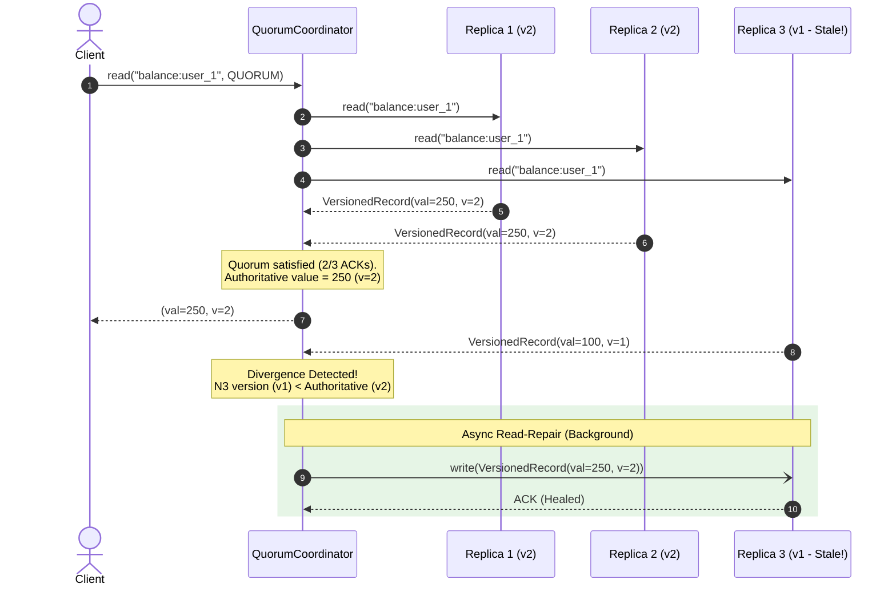
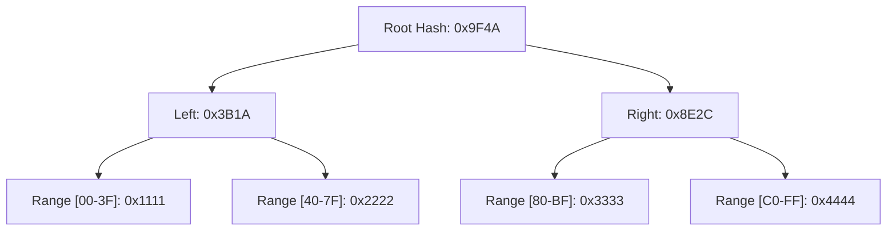

# ⚖️ Quorum Consistency ($R + W > N$) & Read-Repair

> **Domain:** Distributed Storage & Caching Consistency  
> **Production Analogs:** Apache Cassandra, Amazon DynamoDB, Riak KV, ScyllaDB.  
> **Status:** `Production-Grade Reference Implementation`

---

## 1. 30-Second Decision Matrix

| If your requirement is… | Choose Setting | Why | Main Trade-off |
| :--- | :--- | :--- | :--- |
| **Guaranteed linearizable reads (never read stale data)** | **Strict Quorum ($R + W > N$)** | By pigeonhole principle, read quorum is mathematically guaranteed to intersect write quorum. | Requires acknowledgment from majority ($\lfloor N/2 \rfloor + 1$); higher latency. |
| **Ultra-high write throughput & availability (e.g. telemetry ingestion)** | **Fast Write ($W = 1, R = \text{ALL}$)** | Writes acknowledge in $< 1\text{ ms}$; reader pays the cost of checking all replicas. | Any single node outage blocks all read requests ($R = \text{ALL}$). |
| **Ultra-low read latency (e.g. read-heavy caching/product catalog)** | **Fast Read ($R = 1, W = \text{ALL}$)** | Single-node read satisfies query; writes propagate to all nodes synchronously. | Any single node outage blocks all write requests ($W = \text{ALL}$). |
| **Continuous background replica healing without batch downtime** | **Read-Repair (Async)** | Active reads detect version divergence and heal stale replicas in background. | Slight background network/write load during heavy read traffic. |
| **Reconciling deep historical divergence on offline replicas** | **Anti-Entropy (Merkle Trees)** | Hierarchical hash tree exchange identifies divergent key ranges with minimal network transfer. | High CPU and disk I/O during repair cycle (`nodetool repair`). |

---

## 2. The Quorum Overlap Principle

In a distributed cluster of $N$ replicas, client operations can configure **Tunable Consistency**:
- $N$: Total replication factor.
- $W$: Number of replica acknowledgments required for a successful write.
- $R$: Number of replica responses required for a successful read.

```
                  ┌──────────────────────────────────────────────┐
                  │          Total Cluster Replicas (N = 5)       │
                  │  [Node 1]   [Node 2]   [Node 3]   [Node 4]   [Node 5]
                  └──────────────────────────────────────────────┘
                             ▲                  ▲
                             │                  │
               Write Quorum (W = 3)        Read Quorum (R = 3)
           ┌───────────────────────┐      ┌───────────────────────┐
           │ [Node 1] [Node 2] [Node 3] │      │ [Node 3] [Node 4] [Node 5] │
           └───────────────────────┘      └───────────────────────┘
                                       ▲
                                       │
                         [ OVERLAP NODE: Node 3 ]
             Guaranteed to contain the latest version! (R + W = 6 > 5)
```

### The Pigeonhole Invariant
$$R + W > N \implies R \cap W \neq \emptyset$$

Because the read set $R$ and the write set $W$ must overlap in at least one node, the read coordinator will **always** receive at least one copy of the latest acknowledged write.

---

## 3. Architecture & Unified Contract

Implemented in [`core.py`](file:///e:/Downloads/PoCs/04-caching-patterns/quorum-read-repair/core.py):



### Public API Contract
```python
# Write with tunable consistency
coord.write(key="user:101", value={"name": "Alice"}, level=ConsistencyLevel.QUORUM)

# Read with tunable consistency and optional async repair
rec, telemetry = coord.read(key="user:101", level=ConsistencyLevel.QUORUM, async_repair=True)
```

---

## 4. Algorithmic Breakdown with Math & Complexity

### 1. Conflict Resolution: Last-Write-Wins (LWW)
Every record contains an immutable version scalar and physical timestamp:
$$\text{Record} = \langle \text{key}, \text{value}, v \in \mathbb{N}, t \in \mathbb{N}_{\text{ns}} \rangle$$

Given two conflicting records $A$ and $B$:
$$A \succ B \iff (v_A > v_B) \lor (v_A = v_B \land t_A > t_B)$$

### 2. Fault Tolerance Limits
- A cluster of $N$ replicas with write quorum $W$ tolerates up to:
  $$F_W = N - W \quad \text{failed nodes during writes}$$
- A cluster with read quorum $R$ tolerates up to:
  $$F_R = N - R \quad \text{failed nodes during reads}$$
- Under symmetric quorum ($W = R = \lfloor N/2 \rfloor + 1$):
  $$F_{\text{max}} = \lfloor (N - 1) / 2 \rfloor \quad \text{node crashes}$$
  For $N=3 \implies F=1$ crash. For $N=5 \implies F=2$ crashes.

### 3. Read-Repair Modes
- **Synchronous (Blocking) Read-Repair**:
  - The coordinator blocks until the stale replicas have successfully written the authoritative value before returning the read response to the client.
  - **Trade-off:** High tail latency penalty ($p99$) if one of the divergent nodes is slow.
- **Asynchronous (Background) Read-Repair**:
  - The coordinator returns the authoritative record to the client immediately upon satisfying $R$ responses.
  - Background workers heal the stale replicas asynchronously.
  - **Trade-off:** Zero user latency penalty, but a subsequent instant read on a different quorum might still witness the stale node before the background write lands.

---

## 5. Multi-Dimensional Trade-off Matrix

| Consistency Configuration | Write Latency | Read Latency | Read Freshness Guarantee | Node Fault Tolerance ($N=5$) | Best Fit Workloads |
| :--- | :--- | :--- | :--- | :--- | :--- |
| **$W=\text{ONE}, R=\text{ONE}$** | Ultra-low ($<1\text{ ms}$) | Ultra-low ($<1\text{ ms}$) | ❌ Eventual / Stale reads common | 4 nodes down | Non-critical logs, metrics |
| **$W=\text{QUORUM}, R=\text{QUORUM}$** | Medium ($\approx 5\text{ ms}$) | Medium ($\approx 5\text{ ms}$) | ✅ 100% Linearizable (Strong) | 2 nodes down | Financial ledgers, user accounts |
| **$W=\text{ALL}, R=\text{ONE}$** | High (Slowest node) | Ultra-low ($<1\text{ ms}$) | ✅ 100% Linearizable | 0 writes (0 nodes down) | Static configuration, read-heavy catalog |
| **$W=\text{ONE}, R=\text{ALL}$** | Ultra-low ($<1\text{ ms}$) | High (Slowest node) | ✅ 100% Linearizable | 0 reads (0 nodes down) | High-velocity sensor ingestion |

---

## 6. Runnable Lab & Telemetry Guide

### Run Unit Tests
```powershell
.\.venv\Scripts\pytest.exe 04-caching-patterns/quorum-read-repair/test_quorum_read_repair.py -v
```

### Run Quorum Simulation
```powershell
.\.venv\Scripts\python.exe 04-caching-patterns/quorum-read-repair/simulate.py
```

### Simulation Output Highlights
```text
[BENCHMARK 1] Consistency Invariant (N = 5 Replicas, 2 Divergent Nodes)
+-----------------------------------------------------------------------------+
| Consistency Model | Quorum Formula        | Stale Reads | Stale Rate | Data Integrity |
|-------------------+-----------------------+-------------+------------+----------------|
| Weak (ONE)        | R=1, W=3 (R+W=4 <= 5) |    85 / 200 |      42.5% | Inconsistent   |
| Strict (QUORUM)   | R=3, W=3 (R+W=6 > 5)  |     0 / 200 |       0.0% | 100% Strong    |
+-----------------------------------------------------------------------------+

[BENCHMARK 2] Autonomous Self-Healing via Read-Repair
- Initial State: 2 / 5 nodes stale (60% cluster health).
- Read #1: Detected divergence, repaired 2 nodes.
- Final State: 0 / 5 nodes stale (100% cluster health reached autonomously).

[BENCHMARK 3] Client Latency Profile (Slow 20ms Stale Replica)
- Synchronous Repair: 19.06 ms (Client blocks until stale node acknowledges).
- Asynchronous Repair: 17.08 ms (Client served at read latency; repair in background).
```

---

## 7. Bridging to Distributed Architecture

### Why Read-Repair Alone is Not Enough
Read-Repair only heals records that are **actively read**. Cold, dormant records that are rarely queried will remain divergent indefinitely if a node drops out during a write.

### Production Anti-Entropy Strategies (Cassandra / Dynamo)

#### 1. Hinted Handoff
If a target replica is temporarily offline (e.g. rebooting for 30 seconds), the coordinator stores a "hint" locally in an append-only log. Once the replica gossips that it is alive, the coordinator streams the buffered hints directly to the recovered node.

#### 2. Anti-Entropy with Merkle Trees
For offline nodes that missed writes beyond the hinted handoff window (typically $> 3$ hours), Cassandra executes anti-entropy repairs using Merkle Trees:

- Replicas independently hash their partition ranges into a binary tree.
- Nodes exchange only the top-level root hashes ($O(1)$ network transfer).
- If root hashes match, ranges are identical. If they differ, nodes traverse down the tree to pinpoint the exact divergent token range without transferring the underlying rows.

#### 3. Pitfall: Clock Skew & Last-Write-Wins (LWW)
In distributed systems relying on physical NTP clocks, clock drift (e.g. 50ms leap-second adjustments) can cause a newer write with a skewed past timestamp to be permanently overwritten by an older write with a forward-skewed timestamp.
- **Production Defense:** Use hybrid logical clocks (HLC) or Raft/Paxos state machine consensus for linearizable multi-key mutations.
