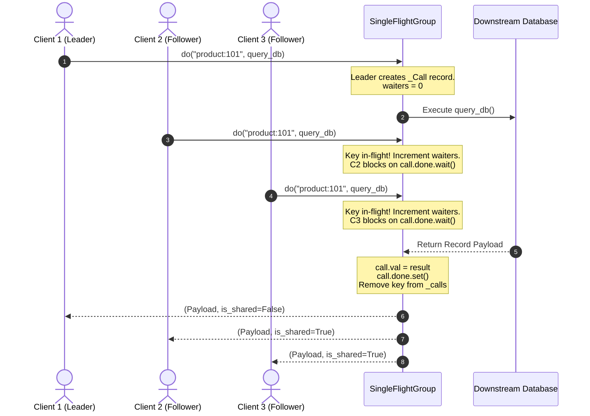
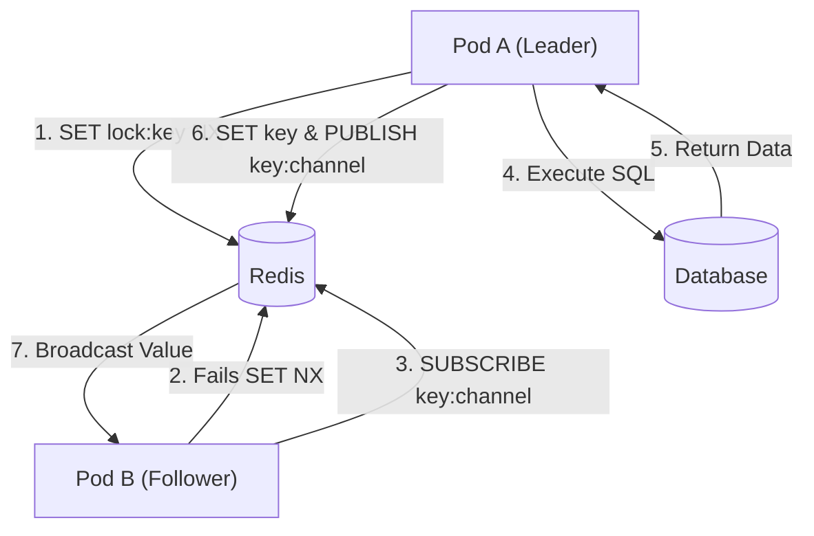

# 🛡️ SingleFlight & Thundering Herd (Cache Stampede) Defense

> **Domain:** Caching Patterns & Availability Engineering  
> **Production Analogs:** Go standard library `golang.org/x/sync/singleflight`, Nginx `proxy_cache_lock`, Cloudflare CDN Request Collapsing, Memcached Gutter / Leases, Meta Cache Stampede Shield.  
> **Status:** `Production-Grade Reference Implementation`

---

## 1. 30-Second Decision Matrix

| If your requirement is… | Choose Pattern | Why | Core Trade-off |
| :--- | :--- | :--- | :--- |
| **Deduplicate simultaneous in-flight misses** | **SingleFlight Coalescing** | Guarantees $\le 1$ downstream query per concurrent burst without holding cache locks long-term. | Late callers share the latency of the primary worker (straggler risk). |
| **Eliminate miss latency on predictable read-heavy keys** | **XFetch Probabilistic Refresh** | Voluntarily recomputes in background *before* hard TTL expiration based on compute delta $\Delta$. | Small percentage of redundant background writes near expiry. |
| **Serve instant responses regardless of freshness** | **Stale-While-Revalidate (SWR)** | Immediately serves expired cached data while single worker refreshes asynchronously. | Tolerates serving eventually consistent / slightly stale payloads. |
| **Multi-instance cross-process coalescing** | **Distributed Lease / Mutex** | Coordinates across distinct app containers using atomic Redis `SET NX` or Pub/Sub. | Network RTT overhead and failure mode complexity if lease-holder crashes. |

---

## 2. The Thundering Herd Problem

When a hot cache key expires or is invalidated under high traffic (e.g. 10,000 req/sec for a viral post or stock quote), thousands of concurrent threads experience a **Cache Miss** at the exact same millisecond. 

```
                               [ THUNDERING HERD DISASTER ]
Clients (10,000 req/s) ──> [ Cache: Key Expired! ] ──> 10,000 Concurrent Queries ──> [ Postgres / Microservice ]
                                                                                             │
                                                                                    🔥 DB Connection Exhaustion
                                                                                    🔥 Thread Pool Saturation
                                                                                    🔥 Cascading System Outage
```

Without synchronization, every thread independently issues an expensive downstream query to the database, exhausting connection pools, driving CPU to 100%, and causing cascading failures.

---

## 3. Architecture & Unified Contract

This PoC provides a dual-defense system implemented in [`core.py`](file:///e:/Downloads/PoCs/04-caching-patterns/thundering-herd/core.py):
1. **`SingleFlightGroup`**: Coalesces concurrent in-flight executions for identical keys into a single execution.
2. **`CacheAsideWithSingleFlight`**: High-level cache manager combining in-memory TTL caching with SingleFlight deduplication.
3. **`XFetchEarlyRefresh`**: Vitter et al.'s optimal probabilistic early expiration algorithm.



### Safety & Concurrency Invariants
- **Atomic Registration**: In-flight keys are tracked in a hash map guarded by a reentrant-safe mutex.
- **Event Synchronization**: Waiting threads block on a primitive `threading.Event`, consuming zero CPU cycles while waiting.
- **Exception Fan-Out**: If the primary thread encounters an unhandled exception (e.g. DB timeout), the exception is captured and re-raised across all waiting caller threads.
- **Strict Cleanup Guarantee**: Removal of the key from the in-flight map is enclosed in a `finally` block, ensuring subsequent requests after resolution trigger a fresh computation.

---

## 4. Algorithmic Breakdown & Mathematical Foundations

### 1. SingleFlight Request Coalescing
- **Time Complexity:** $O(1)$ lookup, synchronization, and cleanup.
- **Space Complexity:** $O(K)$ where $K$ is the number of distinct concurrent in-flight keys.
- **Deduplication Ratio:**
  $$\text{Load Reduction Ratio} = \frac{N - 1}{N} \times 100\%$$
  For $N = 100$ concurrent requests hitting an expired key, DB load drops by $99.0\%$.

### 2. XFetch Optimal Probabilistic Early Refresh
Invented by Astrid S. de Parseval, Vitter, et al. (*"Optimal Probabilistic Cache Stampede Prevention"*), XFetch decides whether a reading thread should proactively refresh an item before it reaches its hard expiration timestamp:

$$\Delta \cdot \beta \cdot (-\ln(U)) \ge \text{expiry} - t$$

Where:
- $\Delta$: Average computation delta (latency in seconds required to compute the value).
- $\beta > 0$: Aggressiveness tuning constant (default $\beta = 1.0$).
- $U \sim \text{Uniform}(0, 1)$: Uniform random variable between 0 and 1.
- $\text{expiry} - t$: Remaining TTL in seconds.

#### Probabilistic Dynamics
- When $\text{expiry} - t \gg \Delta$ (far from expiry), $-\ln(U)$ is almost never large enough, so early refresh probability $\approx 0\%$.
- As $\text{expiry} - t \to 0$ (approaching expiry), the probability monotonically ramps up.
- The highest probability occurs exactly when high traffic is reading the key, ensuring an early background refresh happens with high probability while guaranteeing that at most one or two workers initiate the refresh.

---

## 5. Multi-Dimensional Trade-off Matrix

| Metric / Dimension | Naive Cache-Aside | Mutex Lock (Spin/Wait) | SingleFlight Coalescing | XFetch Probabilistic |
| :--- | :--- | :--- | :--- | :--- |
| **Downstream DB Load** | $O(N)$ (Stampede disaster) | $O(1)$ | $O(1)$ | $O(1)$ |
| **Reader Latency** | $O(1)$ miss latency for all | High tail latency (spin-lock) | Tail bounded by single slowest call | $0\text{ ms}$ (served from cache) |
| **Memory Footprint** | Low | Low | $O(K)$ concurrent keys | Zero extra overhead |
| **Stale Data Served?** | No | No | No | No (fresh before expiry) |
| **Crash Blast Radius** | High (DB brownout) | Deadlock risk if holder dies | Low (exception propagated) | Negligible |

---

## 6. Runnable Lab & Telemetry Interpretation Guide

### Run Unit Tests
```powershell
.\.venv\Scripts\pytest.exe 04-caching-patterns/thundering-herd/test_thundering_herd.py -v
```

### Run Concurrency & Stampede Simulation
```powershell
.\.venv\Scripts\python.exe 04-caching-patterns/thundering-herd/simulate.py
```

### Interpreting Simulation Output
The benchmark launches 100 concurrent threads hitting an expired key simultaneously:
```text
+-----------------------------------------------------------------------------+
| Architecture  |  Concurrent  |  DB Queries   | Coalesced in |       DB Load |
| Pattern       |    Misses    |   Triggered   |     RAM      |     Reduction |
|---------------+--------------+---------------+--------------+---------------|
| Naive         |     100      |      100      |      0       |          0.0% |
| Cache-Aside   |              |               |              |               |
| SingleFlight  |     100      |       1       |      99      |         99.0% |
| Cache-Aside   |              |               |              |               |
+-----------------------------------------------------------------------------+
```
- In **Naive Cache-Aside**, 100 misses result in 100 independent SQL executions.
- In **SingleFlight Cache-Aside**, caller 1 executes the SQL query; callers 2–100 block on `threading.Event` and receive the exact same Python object from memory, slashing downstream query load by **99.0%**.

---

## 7. Bridging to Distributed Architecture

### Why In-Process SingleFlight is Not Enough
In a microservices cluster with 50 application pods behind an ALB, an in-process SingleFlight group protects *each individual pod*. However, if an item expires across the cluster, all 50 pods will each fire 1 query, resulting in 50 queries hitting the database.

### Production Distributed Coalescing Patterns

#### Pattern A: Distributed Mutex via Redis `SET NX`
```lua
-- Atomic lease acquisition: Only 1 pod gets permission to compute
local acquired = redis.call("SET", KEYS[1] .. ":lock", ARGV[1], "NX", "PX", ARGV[2])
if acquired then
    return 1  -- Acquired lock: proceed to query database
else
    return 0  -- Lock held by another pod: wait and re-read cache
end
```

#### Pattern B: Distributed SingleFlight with Redis Pub/Sub


#### Pattern C: Reverse Proxy / CDN Request Collapsing
Configure edge reverse proxies (Nginx / OpenResty / Cloudflare) to coalesce duplicate requests before traffic touches application pods:
```nginx
proxy_cache_path /var/cache/nginx levels=1:2 keys_zone=my_cache:10m inactive=60m;

server {
    location /api/ {
        proxy_cache my_cache;
        proxy_cache_use_stale error timeout updating http_500 http_502 http_503 http_504;
        proxy_cache_lock on;              # SingleFlight coalescing at edge
        proxy_cache_lock_timeout 5s;      # Timeout fallback
        proxy_cache_lock_age 5s;
        proxy_pass http://backend_upstream;
    }
}
```

#### Failure Policy: Fail-Open vs Fail-Closed
- **Fail-Open (Recommended for Reads):** If the primary query times out or fails, serve stale cached data (`stale-if-error`) with HTTP header `Warning: 110 - "Response is Stale"`.
- **Fail-Closed (Required for Financial / Inventory):** If coalesced execution fails, return HTTP `504 Gateway Timeout` or `429 Too Many Requests` with `Retry-After: 1`.
