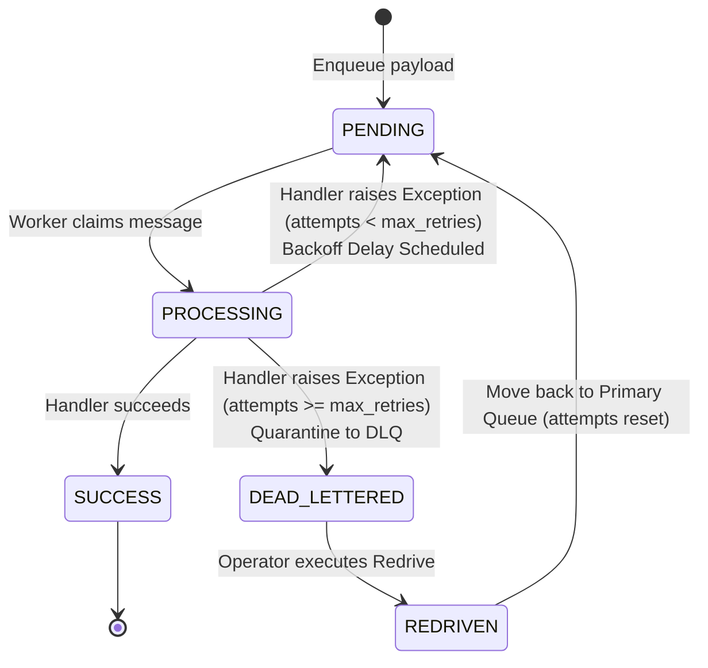
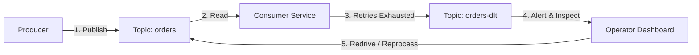

# 💀 Dead Letter Queue (DLQ) & Exponential Backoff with Full Jitter

> **Domain:** Reliability Engineering & Asynchronous Messaging  
> **Production Analogs:** AWS SQS Dead-Letter Queues, Apache Kafka Dead-Letter Topics (DLT), RabbitMQ Dead-Letter Exchanges (DLX).  
> **Status:** `Production-Grade Reference Implementation`

---

## 1. 30-Second Decision Matrix

| If your problem is… | Choose | Why | Main Trade-off |
| :--- | :--- | :--- | :--- |
| **Transient upstream failure (e.g. 503, connection blip)** | **Exponential Backoff with Full Jitter** | Progressively backs off delay; spreads client retry arrivals across $[0, T]$ to prevent retry spikes. | Increases total time to completion for flaky operations. |
| **Poison-pill message (e.g. malformed JSON, missing field)** | **Dead Letter Queue (DLQ)** | Evicts permanently broken message after $K$ attempts; unblocks subsequent valid messages. | Quarantined messages accumulate in DLQ and require manual/automated operator intervention. |
| **Synchronized client retries after downstream brownout** | **Full Jitter (Marc Brooker / AWS)** | Flattens peak concurrent retry spikes by $\ge 80\%$, breaking feedback loops. | Some retries fire earlier with shorter sleep times than deterministic backoff. |
| **Bug patched / Downstream recovered** | **DLQ Redrive / Reprocessing** | Moves quarantined messages back into the primary queue with reset retry quotas. | Risk of re-saturating the system if the underlying root cause was not actually resolved. |

---

## 2. The Thundering Retry Storm & Poison-Pill Problem

### Failure Mode 1: The Thundering Retry Storm
When a shared downstream database experiences a temporary 100ms blip, 1,000 active worker threads fail at $T=0$.
- **Without Jitter**: All 1,000 workers retry at the *exact same instant* ($T = 1.0\text{s}$, then $T = 2.0\text{s}$, then $T = 4.0\text{s}$). The recovering database is hit by synchronized waves of traffic, causing repeated cascading brownouts.
- **With Full Jitter**: The 1,000 workers are uniformly distributed across the backoff window $[0, 1.0\text{s}]$, flattening the traffic spike.

```
Without Jitter:    ||||||||||||||||||||                 ||||||||||||||||||||
                   [All 1,000 at 1.0s]                  [All 1,000 at 2.0s]
                   
With Full Jitter:  |  |   | |  |   |  | |  |   |  | |   |  |   | |  |   |  |
                   [Smooth uniform distribution across time interval]
```

### Failure Mode 2: Poison-Pill Head-of-Line Blocking
A message with corrupted JSON or a non-existent foreign key enters a FIFO queue.
- If the consumer retries infinitely without an exit strategy, the bad message **blocks all subsequent valid messages forever**.
- A **Dead Letter Queue** isolates the bad message after $K$ attempts (e.g. `max_retries = 3`), preserving the failure payload and error stack trace for debugging while allowing the pipeline to proceed.

---

## 3. Architecture & Unified Contract

Implemented in [`core.py`](file:///e:/Downloads/PoCs/05-reliability-and-messaging/dead-letter-queue/core.py):



### Core Public Contract
```python
queue = QueueEngine(base_delay_s=0.5, max_delay_s=30.0, max_retries=3, jitter_strategy=JitterStrategy.FULL_JITTER)

# Enqueue work
msg = queue.enqueue({"order_id": 4201, "customer": "cust_88"})

# Consumer process loop
result = queue.process_one(handler=process_order)

# Operator remediation
redriven_count = queue.redrive_dlq(max_messages=100)
```

### Safety & Processing Invariants
1. **Zero Head-of-Line Blocking**: When a failing message is delayed by backoff (`available_at = now + delay`), it is skipped by consumers, allowing subsequent ready messages to process immediately.
2. **Deterministic DLQ Eviction**: A message transitions to `DEAD_LETTERED` if and only if `attempts >= max_retries`.
3. **Diagnostic Audit Trail**: Quarantined DLQ messages retain full diagnostic history: timestamp trace, original payload, retry count, and last exception message.

---

## 4. Algorithmic Breakdown with Math & Complexity

### 1. Backoff & Jitter Formulations (AWS Brooker Model)
Given:
- $B$: Base delay in seconds (e.g. $0.5\text{s}$)
- $M$: Maximum delay ceiling in seconds (e.g. $30.0\text{s}$)
- $i \ge 1$: Current attempt sequence

#### Deterministic Exponential Backoff (No Jitter)
$$T = \min\big(M, B \cdot 2^{i-1}\big)$$

#### Full Jitter (Recommended for high concurrency)
$$T_{\text{sleep}} = \text{Uniform}\Big(0, \min(M, B \cdot 2^{i-1})\Big)$$
- Yields the lowest work done and maximum reduction in peak retry concurrency.

#### Equal Jitter (Balances minimum sleep with randomness)
$$T_{\text{sleep}} = \frac{T}{2} + \text{Uniform}\Big(0, \frac{T}{2}\Big) \quad \text{where } T = \min\big(M, B \cdot 2^{i-1}\big)$$

#### Decorrelated Jitter (State-dependent)
$$T_{\text{sleep}} = \min\Big(M, \text{Uniform}(B, 3 \cdot T_{\text{prev}})\Big)$$

### 2. Time & Space Complexity
- **Enqueue / Dequeue:** $O(1)$ amortized memory operations.
- **DLQ Redrive:** $O(K)$ where $K$ is the number of messages redriven.
- **Space:** $O(N)$ where $N$ is total pending + quarantined messages.

---

## 5. Multi-Dimensional Trade-off Matrix

### Jitter Strategies

| Strategy | Peak Concurrency Reduction | Average Sleep Duration | Client Latency Spread | Best Fit |
| :--- | :--- | :--- | :--- | :--- |
| **No Jitter** | $0.0\%$ (Synchronized spike) | Maximum ($B \cdot 2^i$) | None (Deterministic) | Single-threaded scripts, non-shared systems |
| **Full Jitter** | **$\ge 80\%$ (Optimal flattening)** | $0.5 \times \text{Deterministic}$ | High ($[0, T]$) | Large distributed systems, AWS SQS, Kafka |
| **Equal Jitter** | $\approx 50\%$ | $0.75 \times \text{Deterministic}$ | Medium ($[T/2, T]$) | Workloads requiring a guaranteed minimum sleep |
| **Decorrelated** | $\approx 70\%$ | High | Variable | Multi-hop RPC retry chains |

---

## 6. Runnable Lab & Telemetry Guide

### Run Unit Tests
```powershell
.\.venv\Scripts\pytest.exe 05-reliability-and-messaging/dead-letter-queue/test_dead_letter_queue.py -v
```

### Run Concurrency & DLQ Simulation
```powershell
.\.venv\Scripts\python.exe 05-reliability-and-messaging/dead-letter-queue/simulate.py
```

### Simulation Output Highlights
```text
[BENCHMARK 1] Retry Synchronization Peak Concurrency (100 Simultaneous Clients)
+-----------------------------------------------------------------------------+
| Backoff Strategy | Formula                  | Peak Retries | Spike Reduction|
|------------------+--------------------------+--------------+----------------|
| Deterministic    | B * 2^i                  | 100 / 100    | 0.0% (Spike)   |
| Full Jitter      | Uniform(0, min(M, B*2^i))| 16 / 100     | 84.0% (Smooth) |
+-----------------------------------------------------------------------------+

[BENCHMARK 2] Poison Pill Quarantine & Zero Head-of-Line Blocking (100 Messages)
- Valid Customer Orders: 95 / 95 (100% Processed successfully)
- Poison Pills Quarantined: 5 (Isolated into DLQ after 3 retries)
- Stuck in Primary Queue: 0 (Zero head-of-line blocking!)

[BENCHMARK 3] Operator DLQ Redrive / Incident Recovery
- Action: Operator triggers redrive after bug fix
- Active in DLQ: 0 (Fully Drained)
- Total Successfully Processed: 100 / 100 (100% Data Preserved)
```

---

## 7. Bridging to Distributed Architecture

### Production SQS Redrive Policy
In AWS SQS, a Dead Letter Queue is configured via JSON Redrive Policy:
```json
{
  "deadLetterTargetArn": "arn:aws:sqs:us-east-1:123456789012:orders-dlq",
  "maxReceiveCount": "3"
}
```

### Apache Kafka Dead-Letter Topic (DLT) Pattern
In Kafka, consumers do not delete messages; failed offsets are committed and forwarded to a companion topic:


### Operational Best Practices for DLQs
1. **Never Silently Ignore the DLQ**: Configure a CloudWatch / Prometheus alarm on `DLQ.ApproximateNumberOfMessagesVisible > 0`. A non-empty DLQ indicates a silent production bug or schema divergence.
2. **Schema Registry Prevention**: Use Confluent Schema Registry or JSON Schema validation at the API Gateway / Producer level to catch malformed messages *before* they enter the primary queue.
3. **Audit Trail Immutability**: Always preserve the original message headers, partition key, and exception trace when forwarding to the DLQ to simplify root cause analysis.
