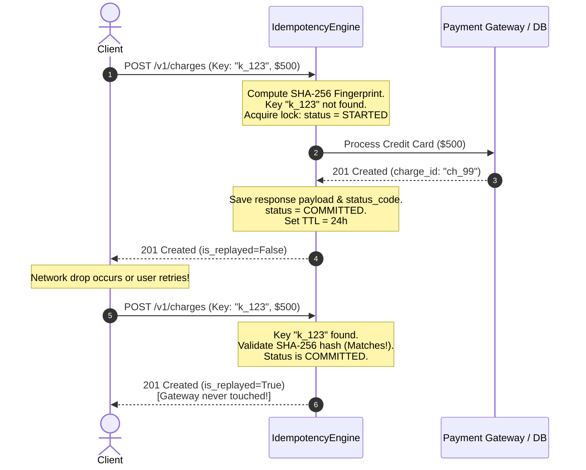

# 🔒 Idempotency Key Engine & Exact-Once Mutations

> **Domain:** Reliability Engineering & Asynchronous Messaging  
> **Production Analogs:** Stripe Payments API, PayPal Webhooks, Adyen Checkout, AWS API Gateway.  
> **Status:** `Production-Grade Reference Implementation`

---

## 1. 30-Second Decision Matrix

| If your requirement is… | Choose | Why | Main Trade-off |
| :--- | :--- | :--- | :--- |
| **Prevent double-charges during client retry storms** | **Idempotency Key Engine** | Associates mutations with a client-supplied unique key; atomic replay bypasses backend work. | Requires dedicated cache/database storage for response payloads and locks. |
| **Deduplicate incoming webhook events from third parties** | **Message ID Dedup Table** | Filters incoming queue payloads by message ID before dispatching to consumer handlers. | Dependent on producer providing reliable, unique message IDs. |
| **Naturally idempotent resource replacement** | **HTTP PUT / DELETE** | Repeated execution yields identical server state by definition ($f(f(x)) = f(x)$). | Unsuitable for non-idempotent business actions (e.g. creating a bank transfer or sending an SMS). |
| **Detect payload tampering or parameter mismatch** | **SHA-256 Fingerprinting** | Computes cryptographic digest over endpoint path and sorted JSON body. | Small CPU overhead to serialize and hash request parameters. |

---

## 2. The Network Timeout & Double-Charge Problem

In distributed architectures, network connections are inherently unreliable. Consider a standard credit card payment flow:

```
[ Client ] ──────── 1. POST /v1/charges ($500) ───────> [ API Gateway ] ───────> [ Payment Gateway ]
                                                                                         │
                                                                                Charges Card ($500)
                                                                                         │
[ Client ] <────── 2. Network Drops / Connection Timeout ─── [ API Gateway ] <───────────┘
    │
    ▼
Client thinks request failed!
Retries: POST /v1/charges ($500) ──────────────────────> [ API Gateway ] ───────> [ Payment Gateway ]
                                                                                         │
                                                                                🔥 Charges Card AGAIN!
                                                                                🔥 User billed $1,000!
```

Without an idempotency layer, every network timeout retry results in a duplicate side-effect (double charge, duplicate order, duplicate notification).

With an **Idempotency Key Engine**, the client attaches `Idempotency-Key: e82f...`. The first invocation processes the payment; the second invocation detects the committed key and replays the cached `$500` receipt without re-executing the payment gateway.

---

## 3. Architecture & Unified Contract

Implemented in [`core.py`](file:///e:/Downloads/PoCs/05-reliability-and-messaging/idempotency-key/core.py):



### Safety & Concurrency Invariants
1. **Exact-Once Mutation**: The downstream business handler executes $\le 1$ time per valid key.
2. **In-Flight Mutual Exclusion**: If two concurrent requests arrive with the same key while the first is in `STARTED` state, the second is safely rejected with HTTP `409 Conflict`.
3. **Payload Fingerprint Verification**: If a client attempts to recycle an idempotency key with differing parameters (e.g. altered amount), execution is halted with HTTP `422 Unprocessable Entity`.
4. **Crash Fault Tolerance**: If a worker crashes during execution, the in-progress lock timeout allows subsequent retries to take over rather than being permanently deadlocked.

---

## 4. Algorithmic Breakdown with Math & Complexity

### 1. Request Fingerprinting Formula
To ensure parameters are not modified between retries, the engine calculates a deterministic SHA-256 digest:

$$\text{Fingerprint} = \text{SHA-256}\Big(\text{Path} \mathbin{\Vert} \text{CanonicalJSON}(\text{Payload})\Big)$$

Where:
- $\text{CanonicalJSON}$ serializes objects with sorted keys and normalized whitespace to eliminate false positives caused by key reordering.
- If $\text{Fingerprint}_{\text{current}} \neq \text{Fingerprint}_{\text{stored}}$, execution fails with `IdempotencyPayloadMismatchException`.

### 2. State Machine Transition Lifecycle
```
[ Incoming Request ]
         │
         ├──> [ Key not found ] ──> Acquire Lock (STARTED) ──> Run Mutation ──┬──> Success: COMMITTED (Cache Response)
         │                                                                   └──> Failure: Evict Lock (Allow Retry)
         │
         ├──> [ Key exists: COMMITTED ] ──┬──> Hash Matches: Return Cached Response (is_replayed=True)
         │                                └──> Hash Differs: 422 Unprocessable Entity
         │
         └──> [ Key exists: STARTED ] ────┬──> Lock Valid: 409 Conflict (Concurrent in-flight)
                                          └──> Lock Expired: Re-acquire Lock (Worker crash recovery)
```

### 3. Complexity
- **Time Complexity:** $O(B)$ where $B$ is request body size for JSON serialization and SHA-256 hashing; $O(1)$ memory lookup.
- **Space Complexity:** $O(K \cdot S)$ where $K$ is the number of active idempotency keys within the TTL window, and $S$ is the average response payload size.

---

## 5. Multi-Dimensional Trade-off Matrix

| Storage Strategy | Concurrency Safety | Durability | Latency | Distributed Cluster Ready? | Best Fit |
| :--- | :--- | :--- | :--- | :--- | :--- |
| **In-Memory Lock** | Thread-level only | Volatile (Lost on pod restart) | $< 0.001\text{ ms}$ | ❌ No | Single container, local unit testing |
| **Redis Distributed Lock (`SET NX`)** | Cluster-level | Semi-durable (In-memory AOF) | $\approx 1\text{ ms}$ | ✅ Yes | High-throughput APIs, edge gateways |
| **RDBMS Unique Constraint (`INSERT ON CONFLICT`)** | Cluster-level ACID | 100% Durable (WAL backed) | $\approx 5\text{--}15\text{ ms}$ | ✅ Yes | Financial ledgers, Stripe transactional core |

---

## 6. Runnable Lab & Telemetry Guide

### Run Unit Tests
```powershell
.\.venv\Scripts\pytest.exe 05-reliability-and-messaging/idempotency-key/test_idempotency_key.py -v
```

### Run Simulation Lab
```powershell
.\.venv\Scripts\python.exe 05-reliability-and-messaging/idempotency-key/simulate.py
```

### Simulation Output Highlights
```text
[BENCHMARK 1] Network Retry Resilience (100 Customers, 35 Dropped ACKs)
+-----------------------------------------------------------------------------+
| Metric                  | Without Idempotency | With Idempotency Key        |
|-------------------------+---------------------+-----------------------------|
| Total HTTP Invocations  | 135                 | 135 (35 retry attempts)     |
| Downstream Card Charges | 135 ($13,500)       | 100 ($10,000) Exact-Once!   |
| Double Charges Avoided  | 0 (35 overcharged)  | 35 ($3,500 protected)       |
+-----------------------------------------------------------------------------+

[BENCHMARK 2] Fast Double-Click Race Condition (50 Concurrent Submissions)
- Primary Mutation Allowed: 1 (201 Created)
- In-Progress Collisions Blocked: 49 (409 Conflict)
- Downstream Gateway Charges: Exactly 1 (Zero double charge risk)

[BENCHMARK 3] Parameter Mutation & Fingerprint Validation
- Altered amount ($10 -> $10,000) with reused key:
  [PASS] Tampering Intercepted: 422 Unprocessable Entity
```

---

## 7. Bridging to Distributed Architecture

### The Production Architecture (Stripe Pattern)
In distributed microservices, a two-layer approach is standard:

```
[ Client ] 
    │
    ▼
[ API Gateway / Nginx ] ──> [ Redis: Fast Lock (SET lock:key NX EX 30) ]
    │ (Lock Acquired)
    ▼
[ Payment Service ] ──────> [ PostgreSQL: ACID Transaction ]
                                ├── INSERT INTO charges (id, amount, status)
                                └── INSERT INTO idempotency_records (key, request_hash, response_body)
                                    ON CONFLICT (key) DO NOTHING;
```

#### Why Atomic DB Transactions are Essential
If the application writes to the payment gateway and then saves the idempotency record in two separate, non-transactional database calls:
- If the pod crashes between step 1 and step 2, the charge was executed, but the idempotency record was never saved!
- The client retries and gets double-charged!
- **Solution (Transactional Outbox):** Write the entity mutation and the idempotency record in the **same ACID transaction** (`BEGIN ... COMMIT`).

#### Industry-Standard HTTP Headers
```http
POST /v1/charges HTTP/1.1
Host: api.stripe.com
Idempotency-Key: 9b1deb4d-3b7d-4bad-9bdd-2b0d7b3dcb6d
Content-Type: application/json

{"amount": 2000, "currency": "usd"}
```

Response on Replay:
```http
HTTP/1.1 200 OK
Idempotent-Replayed: true
Content-Type: application/json

{"id": "ch_3Mtw", "amount": 2000, "status": "succeeded"}
```
