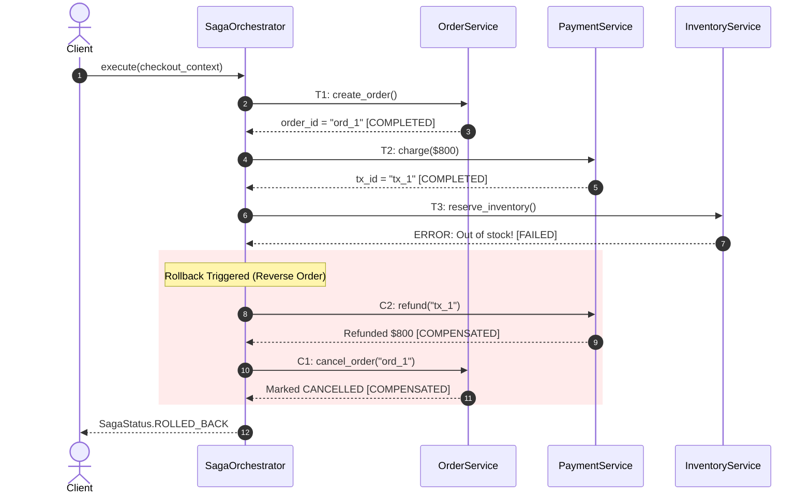
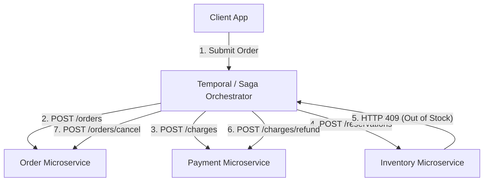

# 🎭 Saga Pattern Orchestrator (Distributed Transactions)

> **Domain:** Distributed Transactions & Reliability Engineering  
> **Production Analogs:** Uber Ride Booking Lifecycle, Temporal.io, AWS Step Functions, Camunda Zeebe, Netflix Conductor.  
> **Status:** `Production-Grade Reference Implementation`

---

## 1. 30-Second Decision Matrix

| If your architecture requirement is… | Choose | Why | Main Trade-off |
| :--- | :--- | :--- | :--- |
| **Multi-service distributed business transaction** | **Saga (Orchestration)** | Centralized coordinator manages workflow DAG; executes compensating transactions on failure without distributed locks. | Requires a central orchestrator; lacks ACID Isolation (dirty reads possible). |
| **Simple decoupled 2-3 service event workflow** | **Saga (Choreography)** | Services react asynchronously to Kafka/RabbitMQ domain events without a central coordinator. | Risk of cyclic dependencies; difficult to monitor and debug failure traces. |
| **Strict ACID guarantees on a single database** | **Local Database Transaction** | Standard `BEGIN ... COMMIT` provides full Atomicity, Consistency, Isolation, and Durability. | Cannot span across independent microservice databases (Database-per-Service). |
| **Synchronous multi-database commit (Legacy)** | **2-Phase Commit (2PC / XA)** | All participants prepare then commit synchronously. | Blocking coordinator protocol; catastrophic latency and availability collapse across networks. |

---

## 2. Why 2-Phase Commit (2PC) Fails in Microservices

In microservices architecture, each service owns its private database. Attempting traditional **2-Phase Commit (2PC)** introduces severe failure modes:
1. **Network Latency & Lock Amplification**: Global database row locks must be held across WAN/RPC network hops during the `Prepare` phase. Throughput drops by $90\text{--}99\%$.
2. **Coordinator Blocking**: If the 2PC coordinator crashes during the prepare phase, participant databases remain locked indefinitely.
3. **Autonomy Violation**: Exposing internal database transactions violates microservice boundary encapsulation.

### The Saga Alternative (Garcia-Molina & Salem, 1987)
A **Saga** is a sequence of independent local database transactions:
- **Forward Sequence**: $T_1 \to T_2 \to T_3 \to \dots \to T_n$
- For every forward action $T_i$, there exists an idempotent **Compensating Transaction** $C_i$ that semantically undoes the effect of $T_i$.
- If any step $T_k$ fails, the orchestrator triggers reverse compensation: $C_{k-1} \to C_{k-2} \to \dots \to C_1$.

```
Forward Path:   [T1: Create Order] ──> [T2: Charge Card] ──> [T3: Reserve Stock] ──> [T4: Dispatch Driver] (FAIL!)
                                                                                                  │
Rollback Path:  [C1: Cancel Order] <── [C2: Refund Card] <── [C3: Release Stock] <────────────────┘
```

---

## 3. Architecture & Unified Contract

Implemented in [`core.py`](file:///e:/Downloads/PoCs/05-reliability-and-messaging/saga-orchestrator/core.py):



### Core Public API
```python
orchestrator = SagaOrchestrator()

orchestrator.add_step(
    name="OrderService.Create",
    action=order_service.create_order,
    compensation=order_service.cancel_order,
).add_step(
    name="PaymentService.Charge",
    action=payment_service.charge,
    compensation=payment_service.refund,
).add_step(
    name="InventoryService.Reserve",
    action=inventory_service.reserve,
    compensation=inventory_service.release,
)

status, final_context = orchestrator.execute(initial_context)
```

### Critical Safety Invariants
1. **Reverse Execution Order**: Compensations execute in exact reverse sequence of completed forward steps ($C_{k-1} \to \dots \to C_1$).
2. **Compensation Idempotency**: Compensating transactions $C_i$ must be completely idempotent ($C_i(C_i(x)) = C_i(x)$). Because network retries may execute a refund multiple times, a refund must never over-credit customer funds.
3. **Semantic Undo**: A compensation does not physically unroll database commits (which would overwrite concurrent mutations); it executes an offsetting business transaction (e.g. applying a credit adjustment).
4. **Audit Journaling**: Every step state transition is appended to a durable audit journal (`SagaLog`) for post-incident debugging and replay.

---

## 4. Algorithmic Breakdown & Mathematical Theory

### 1. Step Classification & The Pivot Transaction
A well-designed Saga categorizes steps into three distinct mathematical classes:

$$\underbrace{T_1, \dots, T_{p-1}}_{\text{Compensable Transactions}} \longrightarrow \underbrace{T_p}_{\text{Pivot Transaction}} \longrightarrow \underbrace{T_{p+1}, \dots, T_n}_{\text{Retriable Transactions}}$$

- **Compensable Transactions ($T_1 \dots T_{p-1}$)**:
  - Transactions that precede the pivot.
  - Guaranteed to have a defined compensation $C_i$ capable of rolling back their effects.
- **Pivot Transaction ($T_p$)**:
  - The **point of no return**.
  - Once $T_p$ commits, the Saga *cannot* be rolled back.
  - If $T_p$ fails, the entire Saga rolls back via $C_{p-1} \dots C_1$.
- **Retriable Transactions ($T_{p+1} \dots T_n$)**:
  - Transactions that follow the pivot.
  - They are guaranteed to succeed eventually (e.g. sending an email receipt or generating an invoice).
  - They are retried with exponential backoff until success and *never* compensated.

### 2. Time & Space Complexity
- **Time Complexity:**
  - Happy Path: $\sum_{i=1}^n \text{Latency}(T_i)$
  - Failure Path (fails at step $k$): $\sum_{i=1}^k \text{Latency}(T_i) + \sum_{i=1}^{k-1} \text{Latency}(C_i)$
- **Space Complexity:** $O(n)$ where $n$ is the number of steps and context variables.

---

## 5. Multi-Dimensional Trade-off Matrix

| Metric | Saga Orchestration | Saga Choreography | 2-Phase Commit (2PC) |
| :--- | :--- | :--- | :--- |
| **Coupling** | Loose (Participant services don't know each other) | Very Loose (Decoupled via events) | Tight (Synchronous DB locking) |
| **Complexity** | Centralized in Orchestrator | Distributed across Event Handlers | Handled by Transaction Manager |
| **Observability** | **High** (Single dashboard view) | **Low** (Distributed trace stitching) | Low |
| **Failure Recovery** | Automatic reverse compensation | Cascading event compensations | Blocking lock timeout |
| **Isolation (ACID)** | ❌ No (BASE: Eventual Consistency) | ❌ No (BASE: Eventual Consistency) | ✅ Full Serializability / Snapshot |
| **Scalability** | **Extremely High** | **Extremely High** | Poor (Fails under latency) |

### The Lack of Isolation (ACID vs BASE)
Because Sagas commit local transactions immediately, other transactions can read intermediate uncommitted data before the Saga completes or rolls back (a **Dirty Read** anomaly).
- **Countermeasures (Semantic Locking)**:
  - Set resource status to `PENDING_APPROVAL` or `RESERVED` rather than immediate commitment.
  - Other business transactions check for semantic locks before acting.

---

## 6. Runnable Lab & Simulation Guide

### Run Unit Tests
```powershell
.\.venv\Scripts\pytest.exe 05-reliability-and-messaging/saga-orchestrator/test_saga_orchestrator.py -v
```

### Run Simulation Lab
```powershell
.\.venv\Scripts\python.exe 05-reliability-and-messaging/saga-orchestrator/simulate.py
```

### Simulation Scenarios Tested
```text
[SCENARIO 1] Happy Path Service State Transitions:
- OrderService: [CREATED]
- PaymentService: Charged $800 (Balance: $200)
- InventoryService: Reserved 1 unit (Stock: 9)
- DeliveryService: Dispatched driver
Saga Status: SUCCESS

[SCENARIO 2] Inventory Out-of-Stock Rollback (Step 3 Fails):
- 1. OrderService: CREATED -> Compensated -> [CANCELLED]
- 2. PaymentService: CHARGED $900 -> Compensated -> [REFUNDED $900 (Balance restored to $1000)]
- 3. InventoryService: FAILED (Stock 2 < Req 5) -> Untouched
- 4. DeliveryService: SKIPPED (Never invoked)
Saga Status: ROLLED_BACK (Zero orphaned funds!)

[SCENARIO 3] Cascading 3-Step Rollback (Step 4 Delivery Fails):
- Rollback 3: Inventory released 2 units back to stock (Stock: 8)
- Rollback 2: Payment refunded $250 to customer (Balance: $500)
- Rollback 1: Order marked CANCELLED
Saga Status: ROLLED_BACK (100% Data Consistency Maintained)
```

---

## 7. Bridging to Distributed Architecture

### Production Orchestrator Engines
In enterprise systems, hand-rolling orchestrators is replaced with resilient distributed workflow engines:
1. **Temporal.io**: Code-as-configuration orchestrator using event-sourcing. If a worker pod crashes mid-saga, another worker recovers the exact local variable state and resumes execution.
2. **AWS Step Functions**: JSON/YAML state machines with built-in retry policies, catch handlers, and native Lambda/SQS integrations.

### Architecture Topology


### Critical Production Policies
- **Compensation Failure Escalation**: If a compensation transaction itself fails (e.g. Payment Gateway returns 500 during refund), the Saga enters `FAILED_COMPENSATION`. The orchestrator must immediately publish an alert to an on-call human operator queue (PagerDuty / Slack) to avoid financial drift.
- **Transactional Outbox**: Microservices should combine local database writes with outgoing event publications using the Transactional Outbox pattern to prevent partial dual-write failures.
