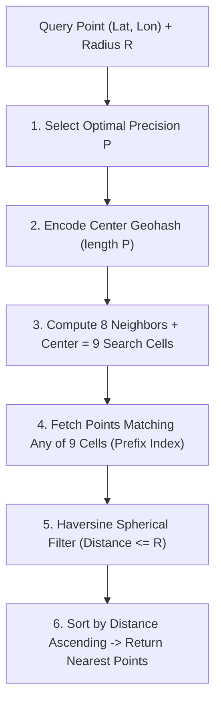

# 📍 Geohash Proximity Engine & Spatial Bounding Box Index

> **Domain:** Geo-Spatial Indexing & High-Throughput Proximity Search  
> **Production Analogs:** Uber Driver Dispatch (H3 / Geohash), Yelp Restaurant Finder, Tinder Proximity Matching, Redis Geospatial (`GEOADD`, `GEORADIUS`), MongoDB 2dsphere index.  
> **Status:** `Production-Grade Reference Implementation`

---

## 1. 30-Second Decision Matrix

| If your spatial requirement is… | Choose | Why | Main Trade-off |
| :--- | :--- | :--- | :--- |
| **Radius proximity queries with standard B-Trees / Redis** | **Base32 Geohash (9-Cell Expansion)** | Flattens 2D coordinates into a 1D string prefix; indexes natively in standard B-Trees, KV stores, and Redis ZSETs. | Suffers from boundary discontinuities (requires 8-neighbor expansion) and latitude distortion near poles. |
| **Equal-area grid with uniform neighbor distances (Ride-hail / Delivery)** | **Uber H3 (Hexagonal Index)** | Hexagons have 1 uniform distance to all 6 neighbors (no diagonal corner distortion). | More complex coordinate conversions; cannot use standard string prefix slicing. |
| **Spherical quadtrees covering Earth with equal area** | **Google S2 (Hilbert Curve)** | Projects Earth onto a cube using Hilbert space-filling curves; minimal cell distortion. | Complex mathematical implementation; larger library footprint. |
| **Complex polygonal GIS intersections & spatial joins** | **PostGIS / R-Tree (GiST Index)** | Handles arbitrary multi-polygons, lines, and shape boundaries natively. | Heavy CPU and memory footprint; poor horizontal scalability under high-frequency writes. |

---

## 2. The 2D Spatial Indexing Problem

Relational databases index 1-dimensional scalar data (integers, strings, timestamps) using B-Trees. However, geographical locations are **2-dimensional** $(\text{latitude}, \text{longitude})$.

A naive query:
```sql
SELECT * FROM drivers 
WHERE lat BETWEEN 37.77 AND 37.79 
  AND lon BETWEEN -122.42 AND -122.40;
```
Forces the database into an expensive table scan or multi-column index scan where one dimension is filtered, but the second dimension must be scanned linearly. At a scale of $100,000$ active drivers updating GPS coordinates every 4 seconds, database CPU saturates immediately.

### The Geohash Solution (Gustavo Niemeyer, 2008)
Geohash uses a **space-filling Z-order curve** to interleave latitude and longitude bits into a single 1-dimensional string using Base32 encoding.
- Spatial proximity in 2D is transformed into shared string prefixes in 1D!
- Points within the same neighborhood share the same prefix (e.g. `9q8yy...` in Downtown San Francisco).

---

## 3. Architecture & Unified Contract

Implemented in [`core.py`](file:///e:/Downloads/PoCs/06-geospatial-and-search/geohash-proximity/core.py):



### Public API Contract
```python
index = GeohashSpatialIndex(index_precision=8)

# Insert driver coordinates
index.insert(point_id="driver_42", latitude=37.7844, longitude=-122.4080, metadata={"status": "available"})

# Execute radius query (returns points sorted by true spherical distance)
matches = index.query_radius(center_lat=37.7850, center_lon=-122.4060, radius_km=2.0, limit=10)
for m in matches:
    print(f"Driver {m.point.id} is {m.distance_km:.2f} km away")
```

### Critical Safety Invariants
1. **The Boundary Discontinuity Defense**: Two points can be 10 meters apart but straddle a Geohash grid boundary line, resulting in completely different prefixes. The engine **always queries 9 cells** (central cell + 8 cardinal neighbors `N, S, E, W, NE, SE, NW, SW`), mathematically eliminating false negatives across borders.
2. **Spherical Haversine Post-Filtering**: Rectangular bounding boxes have diagonal corners that extend further than the search radius ($r_{\text{corner}} = \sqrt{2} \cdot r$). The engine calculates exact spherical Haversine distances to prune corner false positives.

---

## 4. Algorithmic Breakdown with Math & Complexity

### 1. Bit Interleaving Algorithm
1. Latitude interval: $[-90^\circ, +90^\circ]$. Longitude interval: $[-180^\circ, +180^\circ]$.
2. Perform binary division: if coordinate $\ge \text{midpoint}$, emit `1` and contract interval to upper half; else emit `0` and contract to lower half.
3. Interleave bits starting with **Longitude at even bits** and **Latitude at odd bits**:
   $$\text{Bits} = [\text{lon}_0, \text{lat}_0, \text{lon}_1, \text{lat}_1, \text{lon}_2, \text{lat}_2, \dots]$$
4. Group bits into chunks of 5 and encode using Base32 (`0-9, b-z` excluding `a, i, l, o`).

### 2. Cell Dimensions by Precision Level
The bounding box dimensions at precision $p$ are:
$$\Delta\text{Lat}_p = \frac{180^\circ}{2^{\lfloor 5p/2 \rfloor}}, \quad \Delta\text{Lon}_p = \frac{360^\circ}{2^{\lceil 5p/2 \rceil}}$$

| Precision | Bits | Cell Width (Equator) | Cell Height | Physical Resolution | Real-World Use Case |
| :---: | :---: | :---: | :---: | :---: | :--- |
| **1** | 5 | $\approx 5,009\text{ km}$ | $\approx 4,992\text{ km}$ | Continent | Global continent routing |
| **2** | 10 | $\approx 1,252\text{ km}$ | $\approx 624\text{ km}$ | Large State / Country | Regional partitioning |
| **3** | 15 | $\approx 156\text{ km}$ | $\approx 156\text{ km}$ | Metropolitan Area | Airport dispatch zone |
| **4** | 20 | $\approx 39.1\text{ km}$ | $\approx 19.5\text{ km}$ | Municipality / County | Yelp city-wide search |
| **5** | 25 | $\approx 4.89\text{ km}$ | $\approx 4.89\text{ km}$ | City District | Food delivery / Courier |
| **6** | 30 | $\approx 1.22\text{ km}$ | $\approx 0.61\text{ km}$ | Neighborhood | **Uber driver pickup** |
| **7** | 35 | $\approx 153\text{ m}$ | $\approx 153\text{ m}$ | Street Block | Walking distance |
| **8** | 40 | $\approx 38.2\text{ m}$ | $\approx 19.1\text{ m}$ | Building / Parcel | Doorstep / Micro-pickup |

### 3. Haversine Great-Circle Distance
$$d = 2R \arcsin\left(\sqrt{\sin^2\left(\frac{\Delta\phi}{2}\right) + \cos(\phi_1)\cos(\phi_2)\sin^2\left(\frac{\Delta\lambda}{2}\right)}\right)$$
Where $R = 6371.0088\text{ km}$, $\phi$ is latitude in radians, and $\lambda$ is longitude in radians.

### 4. Complexity
- **Encoding / Decoding:** $O(p)$ bit operations where $p$ is string precision ($O(1)$).
- **Radius Search:** $O(K + M \log M)$ where $K$ is the number of points in the 9 candidate cells ($K \ll N$) and $M$ is the number of points matching within radius $R$.
- **Space:** $O(N \cdot p)$ to maintain prefix bucket maps.

---

## 5. Multi-Dimensional Trade-off Matrix

| Metric | Base32 Geohash | Uber H3 (Hexagons) | Google S2 | PostGIS (R-Tree) |
| :--- | :--- | :--- | :--- | :--- |
| **Grid Cell Geometry** | Rectangles (lat/lon) | Hexagons | Spherical Quadrilaterals | Arbitrary geometries |
| **Neighbor Symmetry** | Asymmetric (Corners further than sides) | **Symmetric (All 6 neighbors equidistant)** | Asymmetric | Variable |
| **Index Representation** | Simple string prefix (`9q8yy`) | 64-bit integer | 64-bit integer | Binary spatial tree |
| **Redis / KV Native** | **Excellent (ZSET score)** | Requires custom logic | Requires custom logic | ❌ Not supported |
| **Query Pruning Ratio** | **$\ge 95\%$** | $\ge 97\%$ | $\ge 96\%$ | $\ge 98\%$ |
| **Implementation Complexity** | Low / Clean | Medium-High | High | Low (pre-packaged) |

---

## 6. Runnable Lab & Telemetry Guide

### Run Unit Tests
```powershell
.\.venv\Scripts\pytest.exe 06-geospatial-and-search/geohash-proximity/test_geohash_proximity.py -v
```

### Run Simulation Lab
```powershell
.\.venv\Scripts\python.exe 06-geospatial-and-search/geohash-proximity/simulate.py
```

### Simulation Output Highlights
```text
[BENCHMARK 1] Spatial Search Pruning (10,000 Drivers, Radius = 2.0 km)
+-----------------------------------------------------------------------------+
| Query Strategy        | Points Evaluated | Pruning Ratio | Query Latency    |
|-----------------------+------------------+---------------+------------------|
| Full-Table Scan (O(N))| 10,000           | 0.0%          | 15.79 ms         |
| Geohash 9-Cell Index  | 507              | 94.9%         | 2.00 ms (7.9x!)  |
+-----------------------------------------------------------------------------+

[BENCHMARK 2] The Boundary Line Discontinuity Defense (Driver 111m Away)
- Passenger: (37.7760, -122.4190) -> Geohash: 9q8yyk
- Driver:    (37.7770, -122.4190) -> Geohash: 9q8yym (Different prefix!)
- Naive Prefix Match: FAILED (Misses driver across cell boundary)
- 8-Neighbor Expanded Search: PASSED (Finds driver in North neighbor cell at 111m)
```

---

## 7. Bridging to Distributed Architecture

### Production Redis Geospatial Architecture
Redis implements geospatial indexing internally using **52-bit Geohash integers** stored in a Sorted Set (`ZSET`):

```redis
# 1. Driver reports location every 4 seconds
GEOADD drivers:sf -122.4080 37.7844 "driver_alice"
GEOADD drivers:sf -122.3937 37.7955 "driver_bob"

# 2. Passenger requests rides within 2km
GEORADIUS drivers:sf -122.4060 37.7850 2 km WITHDIST WITHCOORD ASC
```
- Under the hood, Redis converts (lon, lat) to a 52-bit integer score:
  `ZADD drivers:sf <52-bit-geohash-score> "driver_alice"`
- A radius query computes the 9 bounding box ranges:
  `ZRANGEBYSCORE drivers:sf min_score_1 max_score_1` across the 9 cells.

### Sharding High-Throughput Location Ingest
In a global ride-hail system with millions of drivers:
1. **Sharding by Regional Geohash Prefix**:
   - Shard key: `geohash[:3]` or `geohash[:4]`.
   - All drivers in Northern California (`9q...`) live on Cluster Node A.
   - All drivers in London (`gc...`) live on Cluster Node B.
   - Radius searches stay local to a single cluster node.
2. **Handling Regional Boundaries**:
   - Query routes to neighboring regional shards if the 9-cell bounding box spans multiple regional prefix prefixes.
